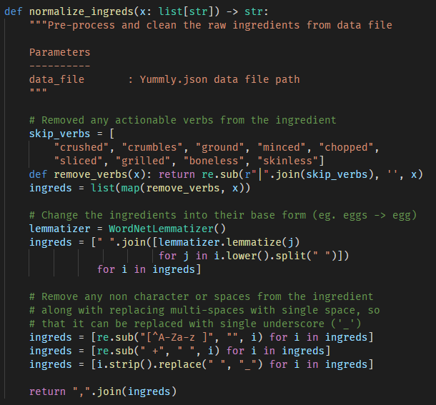
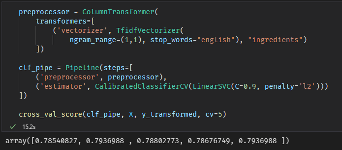
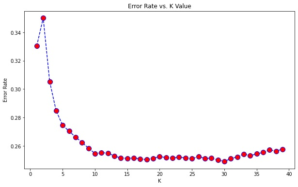
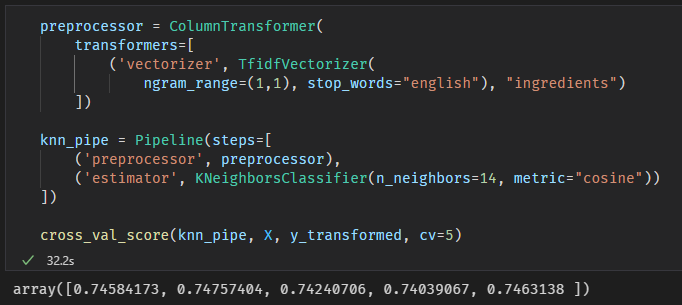
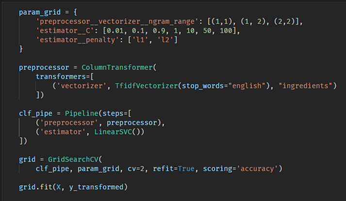
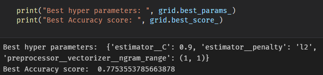
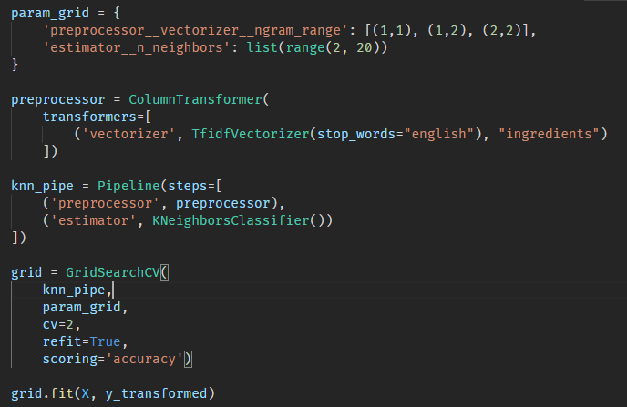
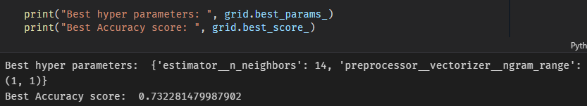
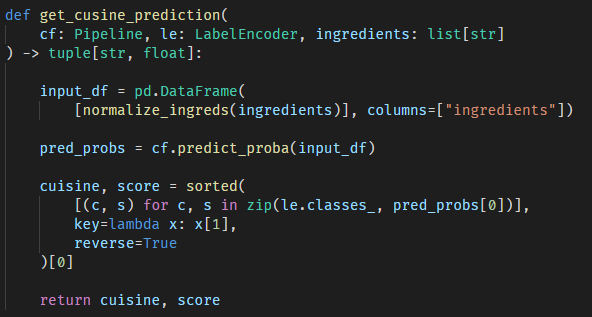
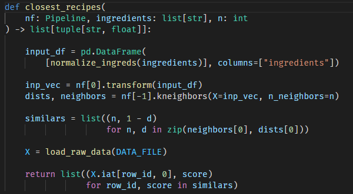

# Documentation
This file includes explanation about the model's hyper parameters tuning, model fitting and deployment. A sample minimum viable product (MVP) implementation of this tool is located [here](../notebooks/MVP.ipynb).

## Overview
> See [Run on local system](../README.md) to run this project locally.

This tool takes a number `N` and a list of `ingredients` using `--N` and `--ingredient` flags. Then this tools uses the provided ingredients to predict a cuisine using `LinearSVC` (0.79 approx. accuracy) and similar dishes or cuisines using `KNeighborsClassifier` (0.74 approx. accuracy).

Explanation about each module can be found later down the document (or follow the below quick links).
- [Data Pre-Processing](#data-pre-processing)
- [Model Selection](#model-selection)
- [Model Training](#model-training)
- [Model Deployment](#model-deployment)

## Data Pre-Processing
Before I can train or test my models, I have to clean my data which is in `yummly.json`. So to do this, I loaded it into a panda's DataFrame using `pd.load_json()`. Then upon viewing the data loaded into the DataFrame, the `ingredients` were in the form of a list which contained multi-word ingredients like `Plain flour` and `KRAFT Zesty Italian Dressing`. So to clean and normalize my ingredients, I created a function called `normalize_ingreds` in [`model_builders.py`](../project2/model_builders.py).

Later, I have used `One-gram TfidfVectorizer` to convert the corpus of ingredients to vectors, so they can be used as the features for model training and testing. Along with that, I used `LabelEncoder` to convert cusine labels into numerical values for better performance and accuracy.

## Model Selection

According to my understanding, the problem at hand is a classification problem and a clustering problem. Trying to predict the **Cuisine** based on the given ingredients is a Classification problem and trying to find **similar dishes** based on the given ingredients is a Clustering problem.

I have considered the following models for classification:
- Logistic Regression
- Naive Bayes
- k-Nearest Neighbors
- Descision Tree and Random Forests
- Linear Support Vector Machines

Upon training and testing the above models using [Cross Validation](https://en.wikipedia.org/wiki/Cross-validation_(statistics)) technique with 5 folds, most of them performed pretty badly due to various reasons. Among them LinearSVC returned the highest score average, so I consided `LinearSVC` for my classification part.

The Cross Validation scores for my `LinearSVC` using 5 folds (circular 80%-20% training-testing data) are as follows:

Moving on to the Clustering problem, my options were less. So I had to choose between K-Means clustering model (un-supervised) and K-Nearest Neighbors classification model (supervised). The KNN's implemetation in scikit-learn library had an handy function called `kneighbors()` which made it easier to get similar dishes based on given ingredients and `cosine` similarity metric.

I used the `elbow method` to get the optimal value for K. In the below graph, the error value stays pretty much the same after `K=14`.

The Cross Validation scores for my `KNeighborsClassifier` with `n_neighbors=14` using 5 folds (circular 80%-20% training-testing data) are as follows:

## Model Training

After choosing the models, I used `Pipeline` from scikit-learn to create two transformer and estimator pipelines, which can be used to predict the cusine and gather similar dishes. But before that, I used `GridSearchCV` to tune my model parameters in this [notebook](../notebooks/Param_Tuning.ipynb).

### Tuning LinearSVC
For tuning my LinearSVC, I have concentrated on the type of n-grams to create using TfidfVectorizer, the Cost and Penality metric for my LinearSVC. The code used for tuning LinearSVC is as follows:

The best score and best parameters found by GridSearchCV are:

### Tuning KNeighborsClassifier
Similarly for tuning my KNeighborsClassifier, I have concentrated on the type of n-grams to create using TfidfVectorizer, the n_neighbors metric for my KNeighborsClassifier. The code used for tuning KNeighborsClassifier is as follows:

The best score and best parameters found by GridSearchCV are:

## Model Deployment

To deploy the models into production, I am using `joblib` to store the python objects onto the disk into a folder called `models`. As explained in Bugs/Assumptions in [README.md](../README.md), when this tool is executed it looks for the models in the `models` folder. And if they do no exist, this tool will create the models, fit them and save them in the `models` folder. Thus, if the tool is executed without the models present in the `models` folder, it will take some time (1-2.5 approx. minutes) to generate the models.

The code responsible to create, fit and dump the models (LinearSVC, KNeighborsClassifier and LabelEncoder) are present in [`model_builders.py`](../project2/model_builders.py). 

Later, the models are loaded using `joblib` in [`model_utils.py`](../project2/model_utils.py). The function `load_models` is responsible for checking if the models exists, create the models and load them for usage. Because there is a lot of involvement of file system access in this tool, I have used `pathlib` to safely access, create or delete (in case of testing) these models.

### Predicing Cuisine
After loading the Cusine Finder (CF) model (LinearSVC), the function `get_cusine_prediction` in [`project2`](../project2/__init__.py) is responsible to getting the prediction and score from the model. This is done using the below code:

### Gathering similar dishes
To gather similar dishes, we used the loaded Neighbors finder (NF) model (KNeighborsClassifier) in the function `closest_recipes` in [`project2`](../project2/__init__.py). This function is responsible to get the given number of closes dishes IDs along with their `cosine` based similarity scores. This is done using the following code:

