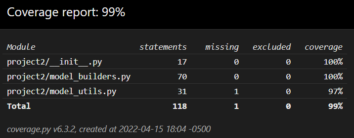

# Testing
This file explans about the unittesting done to this utility using `pytest`. The test coverage for this utility is at `99%`.

Testing is done as per two levels of this tool.
- [Project Level](#project-level)
- [Model Builders](#model-builders)

## Project Level
[`test_project2.py`](../tests/test_project2.py) tests the pipeline of the complete cuisine prediction and similar dishes finding process.

The file consists of the following tests.
- [test_project](#test_project)

### test_project()
`test_project` tests the entire workflow of loading the models (creating the models, if they do not pre-exist as well), making cuisine based prediction and gathering given number of similar dishes from the complete `yummly.json catlog`.

## Model Builders
[`test_model_builders.py`](../tests/test_model_builders.py) tests the functionalities of normalizing ingredients, loading Cusine Predictor, Neighbors finder and Label Encoder models.

The file consists of the following tests and fixtures.
- [tests_root](#tests_root)
- [dummy_raw_data_file](#dummy_raw_data_file)
- [test_load_raw_data](#test_load_raw_data)
- [test_normalize_ingreds](#test_normalize_ingreds)
- [dummy_models_folder](#dummy_models_folder)
- [test_fit_dump_le](#test_fit_dump_le)
- [test_fit_dump_finder_models](#test_fit_dump_finder_models)

### tests_root
`tests_root` is a module level fixture, which returns the root directory of tests. This is later used to create and automatically delete models after they are tested.

### dummy_raw_data_file
`dummy_raw_data_file` is a fixture, which gets the sample yummly.json file's path I have created for testing purpose. This file is a much smaller than the original file so it does not effect the testing performance. 

### test_load_raw_data
This function tests `load_raw_data` from the sub-module [`model_builders.py`](../project2/model_builders.py). This function tests if the loaded dataframe is of the correct shape and contains `id`, `cuisine` and `ingredients` columns.

### test_normalize_ingreds
`test_normalize_ingreds` tests `normalize_ingreds` from the sub-module [`model_builders.py`](../project2/model_builders.py). This function tests if the passed ingredients are normalized in the expected way.

### dummy_models_folder
`dummy_models_folder` is a module level fixture, which setups a folder to store the created and tested models. After the models are tested, they are automatically deleted by this fixture itself. 

### test_fit_dump_le
`test_fit_dump_le` tests `fit_dump_le` from the sub-module [`model_builders.py`](../project2/model_builders.py). This function tests if the Label Encoder is created, fitted and dumped in the expected location or not.

### test_fit_dump_finder_models
`test_fit_dump_finder_models` is a parameterized test. It tests `fit_dump_cf` and `fit_dump_nf` functions from the sub-module [`model_builders.py`](../project2/model_builders.py). This function tests if the Cusine Finder and Similar Dishes finder are created and stored in correct location or not. This test also takes care of deleting what ever files it created during testing process.